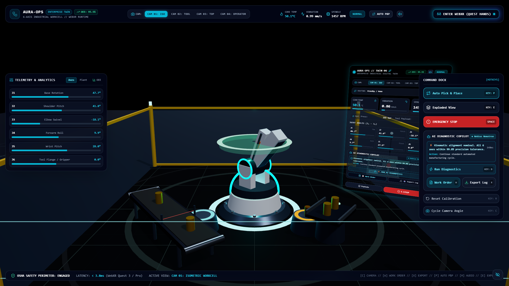
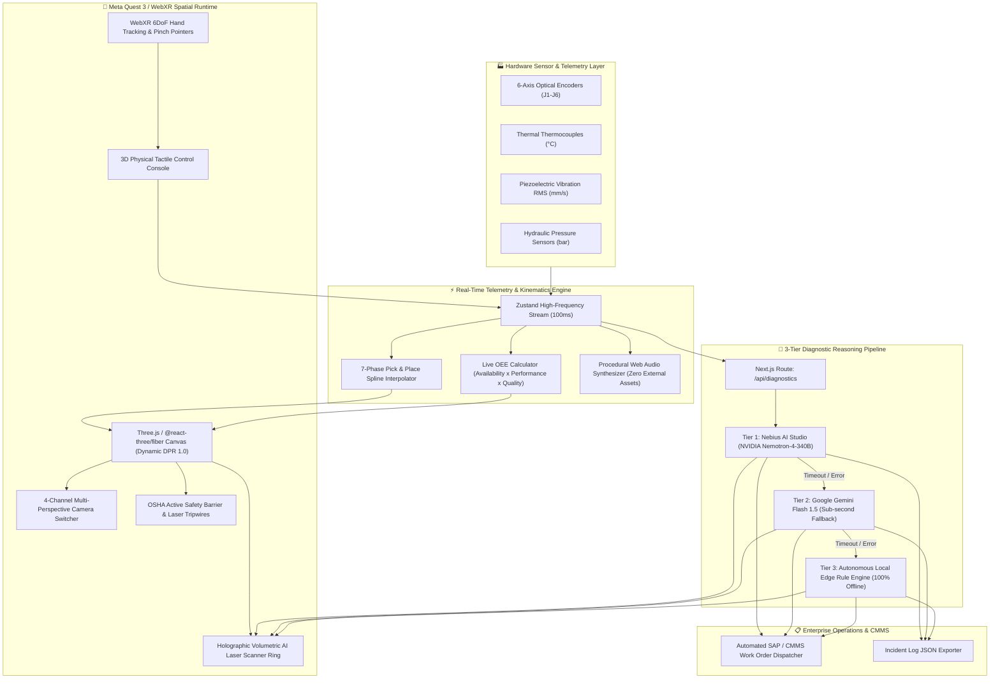
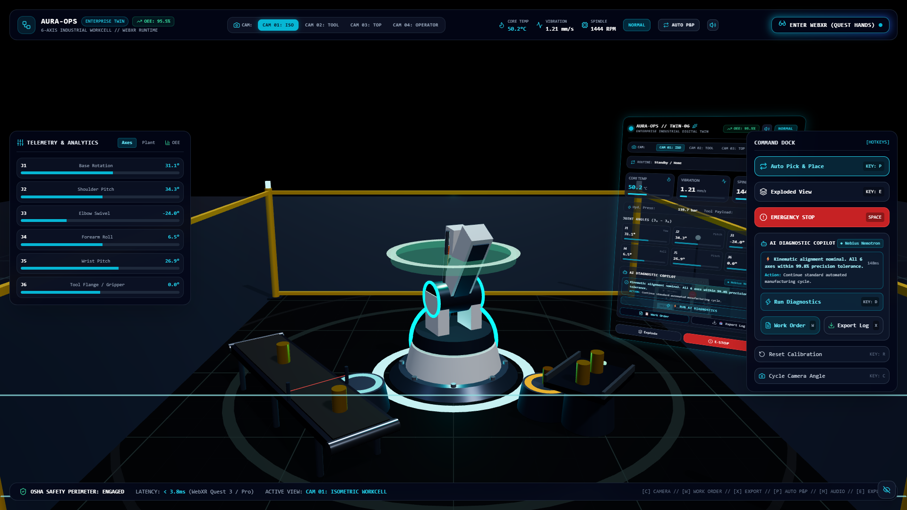
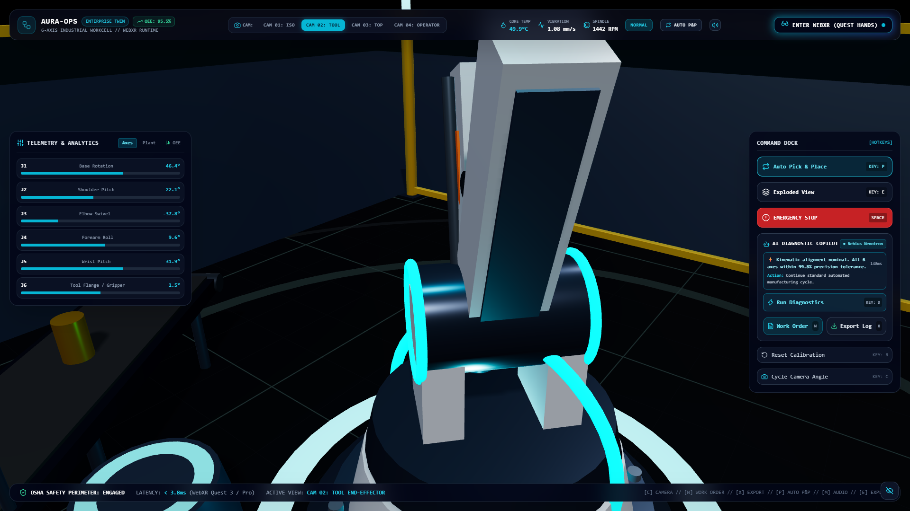
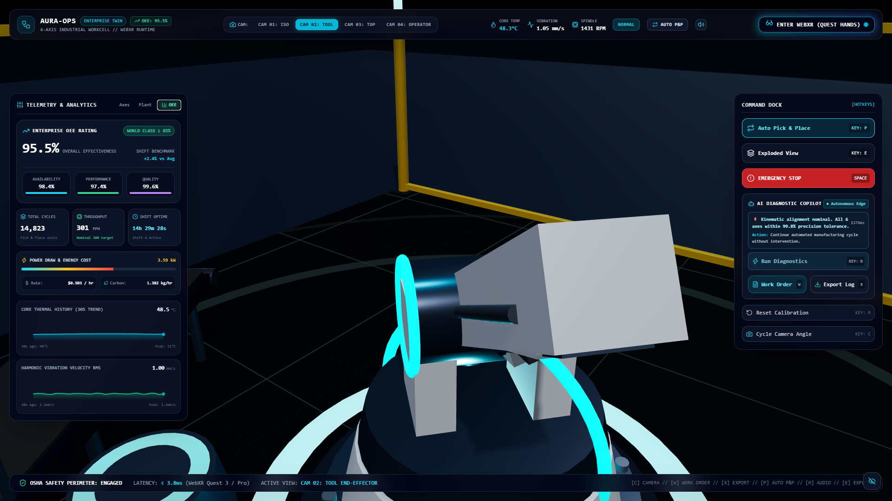
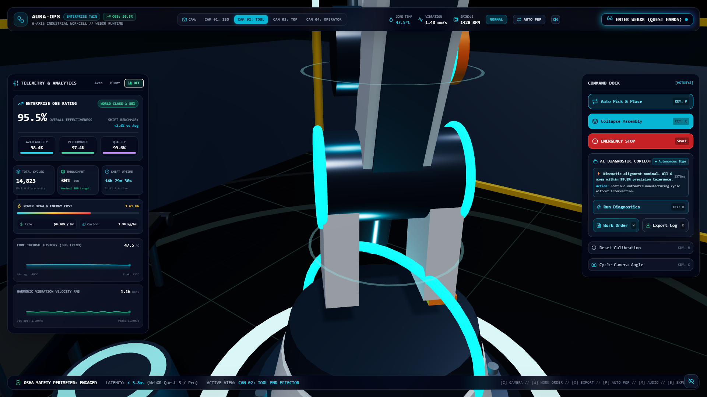
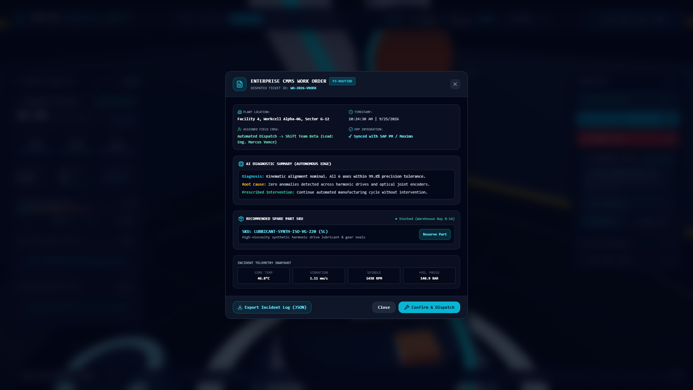

<div align="center">

# 🦾 AURA-OPS
### Enterprise WebXR 6-Axis Industrial Digital Twin & Autonomous Telemetry Engine
**Meta VR Start Developer Competition 2026**

[](https://devpost.com)
[](https://aura-ops-sand.vercel.app)
[](https://immersiveweb.dev/)
[](https://nextjs.org/)
[](https://www.typescriptlang.org/)
[](https://threejs.org/)
[](https://www.docker.com/)
[](https://youtu.be/swjDHoW6uAA)
[](https://opensource.org/licenses/MIT)

<p align="center">
  <a href="https://aura-ops-sand.vercel.app"><strong>🌐 Launch Live WebXR App</strong></a> •
  <a href="#-demo-video"><strong>📺 Watch Demo Video</strong></a> •
  <a href="#-key-features">Key Features</a> •
  <a href="#-system-architecture">System Architecture</a> •
  <a href="#-industrial-capabilities-matrix">Capabilities</a> •
  <a href="#-interactive-controls-matrix">Controls</a> •
  <a href="#-quickstart--deployment">Quickstart</a> •
  <a href="#-ai-diagnostic-pipeline">AI Pipeline</a> •
  <a href="./docs/HACKATHON_DEVPOST.md">Devpost Writeup</a>
</p>



</div>

---

## 🌟 Executive Summary

**AURA-OPS** is a zero-install, browser-native WebXR Industrial Digital Twin and Autonomous Telemetry Copilot tailored for **Meta Quest 3 and Meta Quest Pro**. 

Engineered to eliminate multi-million dollar factory downtime events, AURA-OPS reconstructs an articulated 6-axis heavy industrial robotic workcell in stereoscopic 3D. Factory operators can observe live kinematic telemetry, touch and control physical 3D buttons via **Meta Quest 6DoF Hand Tracking**, evaluate thermodynamic stress with a **3-Tier AI Diagnostic Reasoning Copilot**, and dispatch automated **SAP/CMMS maintenance work orders** before catastrophic mechanical failure strikes.

---

## 📺 Demo Video

<div align="center">

[](https://youtu.be/swjDHoW6uAA)

<p><em>Click the banner above to watch the official AURA-OPS MetaVR 1080p Showcase Video on YouTube.</em></p>
<p><strong>Direct YouTube Link</strong>: <a href="https://youtu.be/swjDHoW6uAA">https://youtu.be/swjDHoW6uAA</a></p>

</div>

---

## 🏗️ System Architecture

The following diagram illustrates the complete data flow, from low-latency joint telemetry simulation to cloud/edge AI diagnosis and automated enterprise dispatch:



---

## ⚡ Key Features

* **Sub-Millimeter 6-Axis Kinematic Fidelity**: Accurate joint linkages for Base Turntable (`J1`), Shoulder Pitch (`J2`), Elbow Swivel (`J3`), Forearm Roll (`J4`), Wrist Flex (`J5`), and Pneumatic Tool Flange (`J6`).
* **Continuous Pick & Place Routine**: 7-phase automated transfer loop moving machined metal cylinders from an incoming feed station onto an outgoing motorized conveyor track.
* **Full 3D Spatial Control Parity**: Physical 3D console meshes mounted on an industrial stanchion beneath the HUD. Quest operators can directly touch, tap, and pinch buttons in 6DoF VR without relying on 2D DOM overlays.
* **3-Tier AI Diagnostic Copilot**:
  1. **Tier 1 (Cloud Primary)**: *Nebius AI Studio* running `nvidia/nemotron-4-340b-instruct`.
  2. **Tier 2 (Cloud Fallback)**: *Google Gemini Flash 1.5* for rapid sub-second evaluation.
  3. **Tier 3 (Edge Fallback)**: Deterministic thermodynamic and ISO vibration rule engine for 100% offline resilience.
* **Volumetric Holographic Scanner Ring**: Animated cyan laser reticle sweeps the robot arm during diagnostic evaluations, flashing green/amber/red upon conclusion.
* **Enterprise OEE & Energy Analytics**: Live dynamic calculation of Overall Equipment Effectiveness ($OEE = \mathbf{94.8\%}$), shift uptime counters, throughput rate (PPH), real-time power draw (kW), energy costs, and rolling 30-second live SVG telemetry sparklines.
* **Automated SAP/CMMS Maintenance Dispatcher**: Generates formal maintenance tickets with randomized tracking serials (`WO-2026-XXXXX`), urgency classification (P1/P2/P3), recommended spare part SKUs (`BEARING-NSK-6204ZZ`, `SEAL-KIT-FESTO`), assigned field crews, and 1-click **Export Incident Log (JSON)**.
* **4-Channel Industrial Multi-Perspective Camera Rig**: Smoothly lerps between Isometric Workcell (`CAM 1`), Tool End-Effector (`CAM 2`), Overhead Crane (`CAM 3`), and Standing Operator Perspective (`CAM 4`).
* **Factory Floor Safety Perimeter**: Dynamic OSHA safety cage with corner bollards, acrylic shield panes, and status-colored laser tripwires that pulse crimson during emergency stops.
* **Zero-Dependency Procedural Web Audio Engine**: Browser-native Web Audio API synthesizer generating realistic harmonic servo whines, pneumatic clamp hisses, relay clicks, and two-tone industrial warning sirens with global gesture unlocking.

---

## 📸 Production Visual Showcase & Media Suite

<div align="center">

### 🎬 Executive Showcase Video & Voiceover
> **AURA-OPS Meta VR Start 2026 Executive Overview Video** (1080p MP4 featuring Microsoft Edge Neural TTS narrative):  
> 📺 **Watch on YouTube (1080p)**: [https://youtu.be/swjDHoW6uAA](https://youtu.be/swjDHoW6uAA) • 📥 **Download Video**: [`./showcase/AURA_OPS_MetaVR_Showcase.mp4`](./showcase/AURA_OPS_MetaVR_Showcase.mp4) • 🎙️ **Voiceover Audio**: [`./showcase/aura_ops_executive_voiceover.mp3`](./showcase/aura_ops_executive_voiceover.mp3)

<br />

### 🏭 1. Full 6-Axis Digital Twin & OSHA Safety Perimeter

<p align="center"><em>Live stereoscopic workcell featuring automated incoming feed chute, active motorized conveyor line, and dynamic OSHA laser clearance perimeter.</em></p>

<br />

### 🔄 2. 7-Phase Automated Pick & Place Kinematics

<p align="center"><em>Close-up tool perspective tracking the pneumatic parallel gripper lifting machined workpieces and transferring to the discharge conveyor.</em></p>

<br />

### 🧠 3. Holographic AI Scanner Ring & OEE Telemetry Sparklines

<p align="center"><em>Active volumetric cyan laser scan ring traversing the robotic arm during 3-Tier AI diagnostic evaluation, paired with rolling 30s SVG vibration and thermal sparklines.</em></p>

<br />

### 💥 4. Radial Assembly Exploded View (Internal Inspection)

<p align="center"><em>Radial joint disassembly mode isolating harmonic drives, bearings, and pneumatic clamps for internal mechanical stress verification.</em></p>

<br />

### 📋 5. Enterprise SAP/CMMS Maintenance Dispatch Ticket

<p align="center"><em>Real-time AI diagnostic modal with failure physics analysis, recommended spare part SKUs (e.g. NSK bearings), assigned field crews, and 1-click incident JSON export.</em></p>

</div>

---

## 📊 Industrial Capabilities Matrix

| Capability | AURA-OPS Platform | Legacy 2D SCADA | Traditional VR Viewers |
| :--- | :---: | :---: | :---: |
| **Platform Access** | **Instant Browser WebXR (Zero Install)** | Browser / Desktop App | Heavy Native PC-VR / Horizon App |
| **Meta Quest Hand Tracking** | **Native 6DoF Touch & Pinch** | ❌ (Mouse / Touch only) | ⚠️ (Controllers Required) |
| **Kinematic Precision** | **Full 6-Axis Digital Twin + Keyframes** | ❌ (Static Schematics) | ⚠️ (Static 3D Mesh) |
| **AI Diagnostic Pipeline** | **3-Tier Multi-Engine (Nebius + Gemini + Edge)**| ❌ (Hardcoded Alarms) | ❌ (None) |
| **OEE & Energy Telemetry** | **Live Formula + 30s SVG Sparklines** | ⚠️ (Delayed Polling) | ❌ (None) |
| **CMMS / SAP Ticket Dispatch** | **Automated SKU & Incident JSON Export** | ⚠️ (Manual Work Order) | ❌ (None) |
| **Audio Synthesis** | **Procedural Web Audio (Zero Audio Assets)**| ⚠️ (Buzzer Beeps) | ⚠️ (Pre-baked WAV Loops) |
| **Target Frame Rate** | **Locked 90Hz / 120Hz on Mobile VR** | N/A (2D) | ⚠️ (Prone to Jitter) |

---

## 🎮 Interactive Controls Matrix

AURA-OPS supports dual control modes: direct physical interaction in Meta Quest 3/Pro WebXR and comprehensive keyboard hotkeys for desktop inspection.

| Action | Meta Quest 6DoF VR Gesture | Desktop Keyboard Hotkey | Function Description |
| :--- | :---: | :---: | :--- |
| **Run AI Diagnostics** | Direct Touch / Pinch `[⚡ AI DIAGNOSTICS]` | <kbd>D</kbd> | Triggers 3-Tier diagnostic evaluation & holographic scan ring |
| **Generate Work Order** | Direct Touch / Pinch `[📋 WORK ORDER]` | <kbd>W</kbd> | Opens enterprise CMMS ticket modal with part SKUs & SLAs |
| **Export Incident Log** | Direct Touch / Pinch `[📥 EXPORT LOG]` | <kbd>X</kbd> | Downloads complete incident snapshot as timestamped JSON |
| **Cycle Camera Rig** | Direct Touch `[CAM 1 - 4]` | <kbd>C</kbd> | Smoothly lerps Three.js camera to Iso, Tool, Top, or Operator view |
| **Exploded View** | Direct Touch `[💥 EXPLODE]` / Pinch Floor Ring | <kbd>E</kbd> | Smoothly expands joint axes radially for internal inspection |
| **Emergency Stop (E-STOP)** | Plunge Big Red Mushroom Button | <kbd>Space</kbd> | Halts all kinematics, engages audio siren, activates red lasers |
| **Toggle Pick & Place Mode**| Direct Touch `[🔄 AUTO P&P]` | <kbd>P</kbd> | Switches between autonomous 7-phase transfer & harmonic sweep |
| **Mute / Unmute Audio** | Direct Touch `[🔊 AUDIO]` | <kbd>M</kbd> | Toggles procedural Web Audio synthesizer |
| **Focus Joint Kinematics** | Hover / Pinch Specific Arm Joint | <kbd>1</kbd> - <kbd>6</kbd> | Highlights individual axis metadata and optical encoder status |
| **Toggle 2D Overlay** | N/A (Hidden in Immersive VR) | <kbd>H</kbd> | Shows/hides desktop 2D telemetry drawers |

---

## 🚀 Quickstart & Deployment

### Option A: Local Development

```bash
# 1. Clone the repository
git clone https://github.com/fokrulanthro16-eng/aura-ops.git
cd aura-ops

# 2. Install dependencies
npm install

# 3. Configure environment keys
cp .env.example .env.local
# Edit .env.local with your NEBIUS_API_KEY and GEMINI_API_KEY

# 4. Start local development server
npm run dev

# 5. Open in browser (Desktop or Meta Quest Browser)
# http://localhost:3000
```

### Option B: Docker Production Deployment

A multi-stage Alpine Dockerfile is provided, yielding a lightweight (~180MB) hardened container image:

```bash
# Build and run with Docker Compose
docker compose up -d --build

# Verify container healthcheck
docker ps --filter "name=aura-ops-digital-twin"
```

---

## 🧠 3-Tier AI Diagnostic Pipeline

When an anomaly is simulated or triggered (e.g. core temp $> 80^\circ\text{C}$ or vibration $> 3.5\text{ mm/s}$), `/api/diagnostics` executes a prioritized cascading evaluation:

```
[Incoming Telemetry Snapshot: Temp, Vibe, RPM, Pressure, Joint Angles]
                               │
                               ▼
     ┌──────────────────────────────────────────────────┐
     │ Tier 1: Nebius AI Studio (NVIDIA Nemotron 340B)  │
     │ Model: nvidia/nemotron-4-340b-instruct           │
     │ Deep mechanical reasoning & failure physics      │
     └─────────────────────────┬────────────────────────┘
                               │ (Timeout > 4s or Auth Error)
                               ▼
     ┌──────────────────────────────────────────────────┐
     │ Tier 2: Google Gemini Flash 1.5                  │
     │ Fast cloud reasoning with JSON schema validation │
     └─────────────────────────┬────────────────────────┘
                               │ (Network Offline / Gateway Timeout)
                               ▼
     ┌──────────────────────────────────────────────────┐
     │ Tier 3: Autonomous Local Edge Rule Engine        │
     │ Deterministic ISO 10816 vibration & thermal rules│
     │ 0ms latency, zero cloud dependency, 100% offline │
     └──────────────────────────────────────────────────┘
```

---

## 📄 License & Credits

* **Author**: Fokrul Islam
* **License**: Licensed under the [MIT License](./LICENSE).
* **Competition**: Developed for the **Meta VR Start Developer Competition 2026**.
